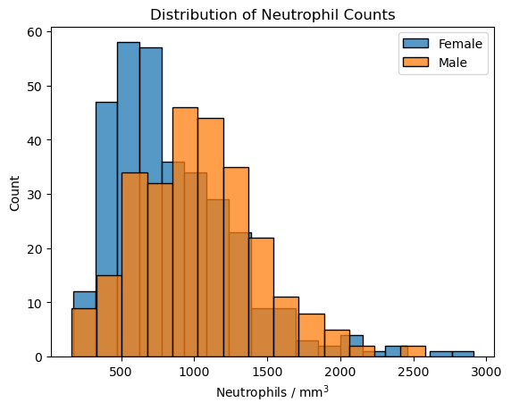

# Overview

In this project we analyzed genetic data of mice to determine how the genotype affects phenotypical features.
The data we have comes from the [Mouse Phenome Database at the Jackson Laboratory](https://phenome.jax.org/projects/Gatti2).
It contains genotypes and phenotypes for 742 different mice.

The functions for data processing are found in [data_conversion/conversion.py](data_conversion/conversion.py), and overall final models are in [Model-Comparison.ipynb](Model-Comparison.ipynb).

## Genotype data
The genotype data comes in the form of Single-Nucleotide Polymorphisms, or SNPs.
The full genome of a mouse consists of a string of nucleotides: A, G, C, and T.
Most of the DNA is the same from mouse to mouse, but there are some positions where two different nucleotides are common.
Each of these positions is a SNP.

Like humans, mice are diploid creatures.
They have two full sets of DNA, one inherited from each parent, and each one can potentially have a different nucleotide for each SNP.
For example, for an A/G SNP, any given mouse may have AA, AG, or GG.
Our data set contains a total of 7854 SNPs.
A typical subset looks like this:

SNP ID|JAXW202.2129|JAXW202.2130|JAXW202.2132|JAXW202.2133|JAXW202.2134
------------|------------|------------|------------|------------|------------
JAX00240603 |TC          |TT          |CC          |TC          |TC
UNC010515443|GG          |GG          |AG          |AG          |GG
UNC010001943|NaN         |AA          |CC          |AA          |NaN
UNC010515539|AG          |AG          |AG          |AG          |GG
UNC010515556|GG          |GG          |AG          |AA          |AG

Each row is a single SNP - a single location in the full DNA sequence - each with a unique identifier.
The columns correspond to the mice, and the entries are the genotype of the mice at the corresponding SNP locations.

## Phenotype data
For phenotype, we focus on the neutrophil count.
Neutrophils are a type of white blood cell that are important for the immune system.
For each mouse we have the neutrophil count, measured in number of cells per cubic millimeter of blood.
We also have information about the sex of each mouse.
Our goal was to come up with the best model we can to predict the neutrophil count from the genotype.

# Data preprocessing
To represent the genotype data numerically, we used a ternary representation where each of the possible SNP expressions is assigned 0, 1, or 2.
For example, for an A/C SNP we assigned them as follows:

DNA|Value
--|-
AA|0
AC|1
CC|2

The choice of 0 or 2 for AA and CC is not important, but what matters more is that AC is between AA and CC.
For the simplified example of a SNP that corresponds to a specific allele, the AC could correspond to the same phenotype as AA or CC depending on whether it is dominant or recessive, or somewhere in between for incomplete dominance.
After converting these to 0, 1, or 2, we check to see which SNPs actually have multiple different values, since some are the same in all the mice in the sample.
We dropped any SNPs that have only a single value, since they wouldn't be of any use in predicting variations among the mice.
Some SNPs are missing for some mice, so to fill in missing values we used the same distribution of values from the non-missing examples of that SNP to avoid biasing it one way or the other.
In the end there were 6604 SNPs that had variation in them.

We also grouped the mice based on sex, and assigned 1 to female and 0 to male.
We then set aside 20% of the data to use as a testing set and used the remaining 80% for training.

# Baseline model

The distribution of neutrophil counts is bell-shaped and somewhat right-skewed.
One notable feature is that the distribution differs based on sex, as seen in this plot:

As a simple baseline, ignoring the genetic data entirely, we just used the average for each sex as a prediction.
Our goal was to be able to use the genotype data to outperform this naive model.

# Model 1: Linear regression, $F$-test, and $p$-values

We have many more features (SNPs) than data points (mice). Trying to use all of them would lead to overfitting, so we needed to find a way to select which ones to focus on. One way to select SNPs is to choose those that are statistically significant when used to predict the neutrophil count. For each SNP we created a single linear regression model that predicts the neutrophil count based just on the ternary value of that SNP, and the sex of the mouse. Then we used an $F$-test to compare each model to the baseline that uses the sex alone, and looked at the $p$-value.

Since we have many different SNPs, we could not just use a significance value of $\alpha = 0.05$ as we would end up with many false positives when testing so many hypotheses simultaneously. Instead we used a Bonferroni correction, meaning that we used as our significance level $\alpha = 0.05 / n$ where $n$ is the total number of hypotheses tested (in our case, the number of SNPs). Using this value for $\alpha$, there were two SNPs that were significant:

|SNP| $p$-value|
|------------|----------|
|UNC141289118| $3\times 10^{-6}$|
|UNC170111028| $2\times 10^{-6}$|

We also looked at the distribution of all $F$-scores, and saw that these two SNPs do look like outliers compared to the rest:

The two $F$-scores on the right correspond to the two SNPs that were beyond the significance threshold.

Our first model, then, is a multilinear regression model using the ternary values of these two SNPs as well as the sex of the mouse.

# Model 2: Non-linear interaction
Rather than consider each SNP independently, it is possible that there could be multiple SNPs that work together to affect the phenotype.
However, even if we just look at pairs of SNPs, there are millions of them and we didn't have the processing power to test each one individually.
If we limited ourselves to the 5% of SNPs that had the highest $F$-scores in the previous section, it was computationally feasible to test all pairs of those.
However, we didn't find any new statistically significant pair.

Using the two SNPs we chose before, we decided to see if including an interaction term between those would improve the model.
We used linear regression on the same features as model 1, but this time with up to second-degree polynomial terms to see if the interaction would improve the model.

# Model 3: Lasso regression
Another possibility we tried is using Lasso regression on all the SNPs, since it naturally tends to select features by the regularization setting some of the coefficients to zero.
We tried different values from $10^{-6}$ to $10^5$ for the regularization parameter alpha, and looked at the mean squared error over a 5-fold cross validation of the training set:

The best MSE in the cross-validation tests occured with an alpha of 50.
Unlike the previous models, which used very few SNPs, this one is much more complicated: it has a total of 40 different SNPs with non-zero coefficients when trained on the training data.
Both SNPs we identified earlier as being statistically significant are included among them.
Unfortunately this extra complexity doesn't help much - it wasn't an improvement over the MSE from models 1 and 2.

# Model 4: PCA
Another option to reduce the dimension was to use an unsupervised algorithm to do so.
We tried to first use PCA on the genotype data, and then predict the neutrophil count using only the most significant $n$ components for different values of $n$.
The 5-fold cross-validation MSE for different numbers of components is shown below:

The best MSE occurred with 42 principal components (interestingly, a similar number of parameters to the previous model).
However, this MSE didn't end up improving on the baseline MSE, suggesting that the information about neutrophil count was likely lost in the less significant principal components.

# Results
An overview of our results is below:

|Model    |Description                          |CV MSE|
|---------------|-------------------------------------|------|
|0: Baseline       |Linear regression using just sex     |184250|
|1: Selected linear|Linear regression using sex and two significant SNPs|171906|
|2: Significant with interaction|Linear regression using the same SNPs as model 1, but with quadratic interaction terms|175384|
|3: Lasso|Lasso regression using sex and all SNPs with $\alpha=50$|182051|
|4: PCA|Linear regression using the first 44 principal components|187587|

Within the training data we were able to improve slightly on the baseline model, and the model with the best cross-validation MSE was also the next-simplest one we tried.
Because it had the best performance and was simplest, we chose to use this for our final model.

Unfortunately, when trying it on the testing data, it doesn't end up being an improvement on the baseline:

|Model    |Testing MSE|
|---------------|------|
|0: Baseline       |163729|
|1: Selected linear|175798|

What does this mean for our analysis?
Overall, our conclusion is that we really just need more data.
There is a lot of variation in neutrophil counts, and if most of it is due to non-genetic factors then it's difficult to find the signal in all the noise.
It's possible that the two SNPs we singled out really are meaningful, and we just got unlucky on our testing set.
Or it could be that their significance was just a false positive.
It would be very interesting if we could repeat this study but with an order of magnitude more mice!

